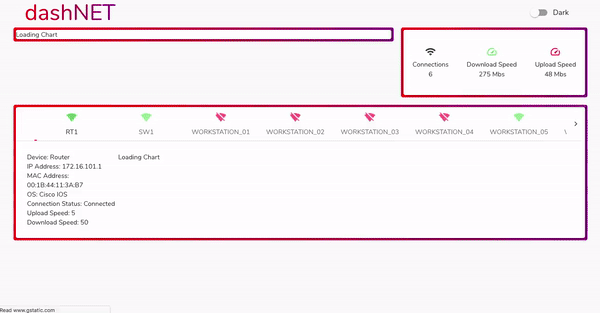

[See the Dashboard in action](https://networkdashboard.netlify.app/) | [Front-end Repo](https://github.com/Dotsworthy/NetworkingPanel)

This project was built as our final project for CodeClan's professional software development course. Version 1 was completed in the first 5 day sprint, we then continued to develop the project after the course finished. It functions as a Networking panel, and is also available for use as a websocket API with updating network data.

Our aim for this project was to model a useful tool. We wanted to build a web app dashboard that would display network data and monitor changes for connected devices. The dashboard would need to display vital stats and enable data to be understood at a glance.

The gif below shows a quickened version of the dashboard, updating with new network data. It starts with 10 timestamps for each device, adds 60 more, and resets to 10. In the live version this repeats every hour.


​
## Project Overview

### Stack
- Python (Flask, SQLAlchemy, Marshmallow, Websockets/Asyncio)
- ReactJS
- HTML/CSS
- Docker/Docker Compose

### Structure

The project consists of three main components: the network server, the app server, and the dashboard. In addition there is a cron-job container which is used to initiate the processes of updating the network data.

[Diagram showing network-app-cron-dashboard + databases and interactions]

#### Network server
The network server stores and presents the static data of each network device, via a RESTful API built using Flask. It is not directly accessible in the live version but is used to provide data to the app server. 

It has a POST route for adding multiple devices, via port 5000 when runnning locally. This route can be used on the server for adding new devices. 

It also has a GET route which updates all device dynamic data and returns all device data as JSON. This allows the network server to mimic a somewhat real changeable network with dynamically generated values.

Example data from the network server, showing the current state of the network:

```yaml
[
    {
        "device_type": "Router",
        "id": 1,
        "ip_address": "172.16.101.1",
        "operating_system": "Cisco IOS",
        "host_name": "RT1",
        "mac_address": "00:1B:44:11:3A:B7",
        "download_speed": 12,
        "upload_speed": 9,
        "active_connection": true
    },
    {
        "device_type": "Switch",
        "id": 2,
        "ip_address": "172.16.101.2",
        "operating_system": "Cisco IOS",
        "host_name": "SW1",
        "mac_address": "00:1B:44:11:5R:B8",
        "download_speed": 38,
        "upload_speed": 12,
        "active_connection": true
    }
]
```
​
#### App server
 
The app server acts as the middle man between the network server and the dashboard. It requests data from the back end and splits the static data (host\_name, device\_type, ...) from the dynamic data (upload\_speed, download\_speed, active\_connection). A time stamp is added to the dynamic data so that the network changes can be tracked and plotted over time. This formatted JSON data is then presented to the front-end via a websocket.

Two cron-jobs trigger different behaviours in the app-server:

**Refresh:** The app server makes a fetch request to the network server for the current network data, before storing as static and dynamic data. Occurs every minute from 01-59.

**Clean:** The app server clears the database and requests a new baseline of 10 datapoints. Occurs every hour at minute 00. This keeps the demo data for the dashboard easy to view.

Example data from the app server, showing multiple snapshots:

```yaml
[
    {
    	"id": 1,
        "mac_address": "00:1B:44:11:3A:B7",
        "ip_address": "172.16.101.1",
        "device_type": "Router",
        "host_name": "RT1",
        "operating_system": "Cisco IOS",
        "snap_shots": [
            {
                "upload_speed": 4,
                "active_connection": true,
                "id": 1,
                "download_speed": 66,
                "time_stamp": "2020-04-30 11:18:50.035494"
            },
            {
                "upload_speed": 0,
                "active_connection": true,
                "id": 13,
                "download_speed": 58,
                "time_stamp": "2020-04-30 11:19:03.387041"
            }
        ]
    },
    {
    	"id": 2,
        "mac_address": "00:1B:44:11:5R:B8",
        "ip_address": "172.16.101.2",
        "device_type": "Switch",
        "host_name": "SW1",
        "operating_system": "Cisco IOS",
        "snap_shots": [
            {
                "upload_speed": 0,
                "active_connection": false,
                "id": 2,
                "download_speed": 0,
                "time_stamp": "2020-04-30 11:18:50.304669"
            },
            {
                "upload_speed": 0,
                "active_connection": false,
                "id": 14,
                "download_speed": 0,
                "time_stamp": "2020-04-30 11:19:03.404504"
            }
        ]
    }
]
```

#### Network Dashboard
The network dashboard is a React web app which connects to the app server via a websocket. It updates its state whenever it recieves new data from the app server.

It displays the individual device data and network summary data as it varies over time.

## API usage

The back end of the project can be accessed through a websocket (wss://network-sim.fraserkeir.com) on the App server. From there you can access the current state of the network data in JSON format.

The database is cleared at 00 every hour, and refreshed to have 10 snapshots for each device. A new snapshot is read from the network server every minute 01-59. A connected websocket will be sent the updated data every time the app server is updated.

The refresh/clean action of the websocket is password protected, so that it is only triggered by the refresh/clean cron requests.

## Local set up

The back end of the project runs in three docker containers. You'll need [Docker](https://docs.docker.com/get-docker/) and [docker-compose](https://docs.docker.com/compose/install/) installed to create and start the Docker images:

```
docker-compose up
```
You can also use the ` -d ` tag to run the containers in detached mode. Once you are finished, stop the server using:

```
docker-compose down
```
Or `ctrl-c` to cancel within the non-detached mode terminal window. 

Optional: to password protect the websocket, create a .env file at the top level of the project and set the password as `CRON_PASS=password`

### Docker-compose

Docker-compose is used to make the build and teardown of the application much simpler, when deploying and making changes. It also makes communication between the back-end servers more straight forward; as a small port-based network.

Each container has a Dockerfile which contains the necessary commands to assemble and run itself. The docker-compose.yml file contains the configuration details for running the three containers together.

**services:** contains and names the three containers

**build:** specifies the path to the build context.

**ports:** specifies the exposed ports, host-to-expose:container-exposed

**depends_on:** specifies dependency between containers. Containers which are depended on will start first.

**environment:** specifies environment variables which are passed to the container. In our case the environment variables are loaded in using variable=$${variable} syntax from the .env file.

## Functionality

### App server: fetching, formatting, and presenting data

This function fetches the current state of the network server and logs the data in a SQLite database. The incoming JSON contains static data (host\_name, device\_type, ...) and dynamic data (upload\_speed, download\_speed, active\_connection). These are separated out to avoid storing multiple copies of the static data. The dynamic data is split off and stored as a snapshot for each device.

Each device is looped through, and the dynamic data removed from the device. The function then checks if the device has an existing database\_entry using the `mac_address` unique key. If the device doesn't exist: it's added to the database. The database id of the device, along with it's dynamic data and a `time_stamp` is recorded as a `snap_shot` on the dynamic data table.

```python
def refresh_data():
    fetch = requests.get('http://network:5000/devices/')
    devices = fetch.json()
    
    for device in devices:
        del device["id"]
        active = device.pop("active_connection")
        upload = device.pop("upload_speed")
        download = device.pop("download_speed")

        found_device = session.query(StaticData).filter_by(mac_address=device["mac_address"]).first()
        if found_device:
            static_data_id = found_device.id
        else:
            new_device = StaticData(**device)
            session.add(new_device)
            session.commit()
            static_data_id = new_device.id

        snap_shot = {
            "static_data_id":static_data_id,
            "time_stamp": datetime.now(),
            "active_connection":active,
            "upload_speed":upload,
            "download_speed":download
            }
        dynamic_data = DynamicData(**snapshot)
        session.add(dynamic_data)
        session.commit()
```

### Cron jobs and the refresh-clean cycle

Two cron-jobs trigger different behaviours in the app-server:

**Refresh:** The app server makes a fetch request to the network server for the current network data, before storing as static and dynamic data. Occurs every minute from 01-59.

**Clean:** The app server clears the database and requests a new baseline of 10 datapoints. Occurs every hour at minute 00. This keeps the demo data for the dashboard easy to view.

The two cron-jobs make use of the same bash and python scripts to send a different trigger to the app server. request.sh passes it's argument (refresh or clean) as a string to the python request.py. This keeps the code DRY and still allows the bash script to log each request.

```bash
1-59 * * * * root /request.sh refresh;
0 * * * * root /request.sh clean
```

This function connects to the app server via a websocket and passes its argument ("refresh" or "clean"), along with an optional password to authenticate the connection. If no password is used, it will be a `None` value in both the cron-job and app server (allowing the cron-job to trigger the appropriate response).

```python
async def request():
    uri = "ws://app:5001/"
    async with websockets.connect(uri) as websocket:
        await websocket.send(json.dumps({
            "socket_type": sys.argv[1],
            "password": os.getenv('CRON_PASS')
            }))
        await websocket.close()
```

This method is used in the cron container start.sh to prepend the crontab file with the CRON_PASS environment variable. This is necessary for the cron user to see the correct environment variable. Adding the password this way allows the app server and cron-job to load the password from the same .env file and makes it easier to conceal and change.

```bash
env | grep '^CRON_PASS' | cat - crontab > /etc/cron.d/simple-cron
```

### App server websocket

When a client connects to the app server; register() adds it to the set of connected websockets and sends it the current network data. unregister() removes the client from the set when the websocket disconnects.

The runner function listens for messages from the connected websockets. This is where the cron-jobs are recieved: if the password matches and the `socket_type` is valid it will trigger either the refresh or clean actions of the app server. Once either of these actions have activated, all connnected dashboards will receive the complete updated network data.

```python
async def runner(websocket, path):
    await register(websocket)
    try:
        async for message in websocket:
            data = json.loads(message)
            if data["socket_type"] == "refresh" and data["password"] == cron_pass:
                refresh_data()
                await notify_dashboards()
            elif data["socket_type"] == "clean" and data["password"] == cron_pass:
                clean_data()
                seed_data(10)
                await notify_dashboards()
            else:
                logging.error("unsupported event: {}", data)
    finally:
        await unregister(websocket)
```

### Dynamic network data

To mimic varying network behaviour, the network server updates the dynamic data of each device. The update() function first randomises the active_connection status; with a bias preferring its current state. This favours a more realistic scenario where device connection is stable. 

If the device is connected to the network, it recieves a random upload/download speed within preset bounds. If the device isn't connected, it's upload/download speed is set to 0.

```python
def update(self):
	self.update_active_connection()
	self.update_upload_download()

	db.session.commit()
```

```python
def update_active_connection(self):
    if random.randint(1,5) > 4:
        self.active_connection = not self.active_connection
```

```python    
def update_upload_download(self):
    if self.active_connection:       
        self.upload_speed = random.randint(0, 12)
        self.download_speed = random.randint(0, 70)
    else:
        self.upload_speed = 0 
        self.download_speed = 0
```

## Version history

1.0.0 App & Network servers: HTTP APIs

2.0.0 App server: websocket API | Network server: HTTP API

2.0.1 App server: password protected websocket API | Network server: HTTP API


